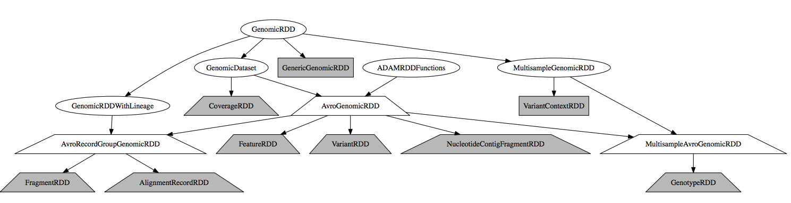
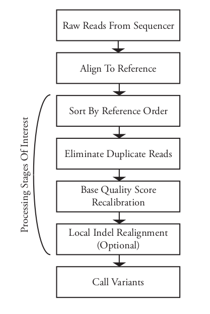
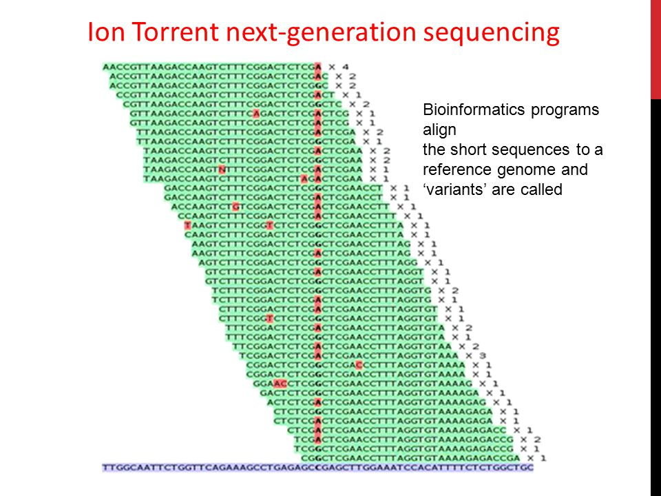

[//]: # (https://www.ncbi.nlm.nih.gov/pmc/articles/PMC3198575/pdf/btr509.pdf)

[//]: # (pandoc presentation.md -t beamer -o final.pdf)

# Topics

+ ADAM/Avocado Schemas & Class heigherarchy
+ Biallectic Genotyper Execution (variant calling)
  - Cannonical SNP caller algorithm

# ADAM Schemas Heigherarchy

{ width=100% }

- GenomicRDD = abstract wrapper for genomic datasets.
- GenomicRDD wraps Spark RDD *and* **Spark SQL DataFrame**
    + Single class provides abstraction of both representations
- ADAMContext loads GenomicsRDDs to manipulate

# bdg-formats schemas

ADAM provides several schemas convenient for representing genomic data

- *AlignmentRecord schema* - represents a genomic read & that read’s alignment to a reference genome.
- *Feature schema* - represents a generic genomic feature. Annorate a genomic region annotation, (e.g. coverage observed over that region, or the coordinates of an exon) .
- *Fragment schema* - represents a set of read alignments that came from a single sequenced fragment.
- *Genotype schema* - represents a genotype call, along with annotations/quality/read support of called genotype.
- *NucleotideContigFragment schema* represents a section of a contig’s sequence.
- *Variant schema* - represents a sequence variant & statistics across samples (indivisuals) and annoration on effect.

# GenomicRDD

	trait GenomicDataset[T, U <: Product,
	 V <: GenomicDataset[T, U, V]] {

	  // These data as a Spark SQL Dataset.
	  val dataset: Dataset[U]

	  // The RDD of genomic data that we are wrapping
	  val rdd: RDD[T]

	  // This data as a Spark SQL DataFrame
	  def toDF(): DataFrame = {
	    dataset.toDF()
	  }

	  ...
	}

# Avocado SNP Algorithm

Recall genomic tertiary analysis pipeline

# Avocado SNP Algorithm

- *Biallelic Variant Calling*
	+ **biallelic** genomic locus - site where only two alleles are observed
	+ **multiallelic** genomic locus - site where many alleles are observed

- The statistical algorithm used to "call variants" in Avocado (i.e. the business-end of Avocado)

+ Originally implemented and used in GATK and SAMtools
+ First presented in:"A statistical framework for SNP calling, mutation discovery, association mapping and population genetical parameter
estimation from sequencing data" Heng Li, Bioinformatics 2011 Nov 1;27(21):2987-93. doi: 10.1093/bioinformatics/btr509.
+ Deals with calling variants under sequencing error rates

# Avocado Biallelic Genotyper Call Graph

Example usage:
		
      avocado-submit -- biallelicGenotyper align-in.bam variants-out.adam

1. `loadAlignments`
	- From BAM/FASTQ/ADAM/Parquet file format
2. `Prefilter Reads`
	- Autosome (non-sex), sex chromosome, mitochondrial (by name)
	- Mapped reads, high enough quality reads, mapped duiplicates
3. `DiscoverVariants` ($\sim 8$ seconds)
4. `CallVariants`  ($\sim 15$ seconds)
5. `HardFilterGenotypes`
6. `saveAsParquet` ($\sim 25$ seconds)

# Avocado Biallelic Genotyper RDD Lineage

RDD Lineage 1: variant discovering

	(200) ShuffledRDD[17] at sortByKey at TreeRegionJoin.scala:45 []
	  +-(200) MapPartitionsRDD[13] at keyBy at BiallelicGenotyper.scala:110 []
	      |   MapPartitionsRDD[12] at map at DiscoverVariants.scala:101 []
	      |   MapPartitionsRDD[11] at rdd at DiscoverVariants.scala:100 []
	      |   MapPartitionsRDD[10] at rdd at DiscoverVariants.scala:100 []
	      |   MapPartitionsRDD[9] at rdd at DiscoverVariants.scala:100 []
	      |   ShuffledRowRDD[8] at rdd at DiscoverVariants.scala:100 []
	      +-(3) MapPartitionsRDD[7] at rdd at DiscoverVariants.scala:100 []
	         |  MapPartitionsRDD[6] at rdd at DiscoverVariants.scala:100 []
	         |  MapPartitionsRDD[5] at rdd at DiscoverVariants.scala:100 []
	         |  MapPartitionsRDD[4] at flatMap at DiscoverVariants.scala:79 []
	         |  MapPartitionsRDD[3] at map at PrefilterReads.scala:82 []
	         |  MapPartitionsRDD[2] at filter at PrefilterReads.scala:81 []
	         |  MapPartitionsRDD[1] at map at ADAMContext.scala:1327 []
	         |  /home/jdeaton/Datasets/1000Genomes/NA12878/scratch/NA12878.algn.adam NewHadoopRDD[0] at newAPIHadoopFile at ADAMContext.scala:1318 []

# Avocado Biallelic Genotyper RDD Lineage

RDD Lineage 2: variant calling

	(200) MapPartitionsRDD[36] at map at GenomicRDD.scala:3755 []
	  |   MapPartitionsRDD[35] at flatMap at HardFilterGenotypes.scala:246 []
	  |   MapPartitionsRDD[34] at map at RewriteHets.scala:73 []
	  |   MapPartitionsRDD[33] at map at BiallelicGenotyper.scala:569 []
	  |   MapPartitionsRDD[32] at map at BiallelicGenotyper.scala:552 []
	  |   MapPartitionsRDD[31] at rdd at BiallelicGenotyper.scala:551 []
	  |   MapPartitionsRDD[30] at rdd at BiallelicGenotyper.scala:551 []
	  |   MapPartitionsRDD[29] at rdd at BiallelicGenotyper.scala:551 []
	  |   ShuffledRowRDD[28] at rdd at BiallelicGenotyper.scala:551 []
	  +-(3) MapPartitionsRDD[27] at rdd at BiallelicGenotyper.scala:551 []
	     |  MapPartitionsRDD[26] at rdd at BiallelicGenotyper.scala:551 []
	     |  MapPartitionsRDD[25] at rdd at BiallelicGenotyper.scala:551 []
	     |  MapPartitionsRDD[20] at flatMap at BiallelicGenotyper.scala:434 []
	     |  MapPartitionsRDD[19] at map at BiallelicGenotyper.scala:113 []
	     |  MapPartitionsRDD[18] at flatMap at TreeRegionJoin.scala:188 []
	     |  MapPartitionsRDD[14] at flatMap at BiallelicGenotyper.scala:111 []
	     |  MapPartitionsRDD[3] at map at PrefilterReads.scala:82 []
	     |  MapPartitionsRDD[2] at filter at PrefilterReads.scala:81 []
	     |  MapPartitionsRDD[1] at map at ADAMContext.scala:1327 []
	     |  /home/jdeaton/Datasets/1000Genomes/NA12878/scratch/NA12878.algn.adam NewHadoopRDD[0] at newAPIHadoopFile at ADAMContext.scala:1318 []

# `DiscoverVariants`

Goal: using reference alignment data, discover all of the places where this new genome exists.

- Input: RDD of reads i.e. `RDD[AlignmentRecord]`

First two steps:
1.  Map `variantsInRead` over the `RDD[AlignmentRecord]`
	- `variantRdd = rdd.flatMap(variantsInRead)`
	- `variantsInRead` loops over CIGAR `string` in each `AlignmentRecord`
		+ CIGAR `string` was created during alignment
		+ `"42M5D56M"` = "$42$ matchnig, $5$ deleted bases,$56$ matchnig"
		+ Emits a stream of variants for each CIGAR `string`
2. Convert `variantsInRead` (RDD) to Dataframe

# `DiscoverVariants` continued...

3. Find unique variants (Dataframe SQL operation)

		val uniqueVariants = optMinObservations.fold({
			variantDs.distinct
		})(mo => {
			variantDs.groupBy(variantDs("contigName"),
			variantDs("start"),
			variantDs("referenceAllele"),
			variantDs("alternateAllele"))
			.count()
			.where($"count" > mo)
			.drop("count")
		})

4. Convert Dataframe back to RDD
	
		uniqueVariants.as[DiscoveredVariant]
			.rdd.map(_.toVariant)

# Avocado Biallelic Genotyper Call Graph

Example usage:
		avocado-submit -- biallelicGenotyper in.bam out.adam

1. `loadAlignments`
	- From BAM/FASTQ/ADAM/Parquet file format
2. `Prefilter Reads`
	- Autosome (non-sex), sex chromosome, mitochondrial (by name)
	- Mapped reads, high enough quality reads, mapped duiplicates
3. `DiscoverVariants` ($\sim 8$ seconds)
4. **`CallVariants`  ($\sim 15$ seconds)**
5. `HardFilterGenotypes`
6. `saveAsParquet`

# Variant calling theoretical foundations

# Variant calling theoretical foundations

- $m$: "ploidy of the sample", i.e. the number of alleles of that locus in the individual
- $g$: the "genotype", i.e. the number of those alleles which are of the reference
- $k$: number of reads of that locus

Without sequencing error, the probability of observing the reference base, $r$ in read $j$ ($R_j$) is 

$$P(R_j = r \ | \ g) = \frac{g}{m}$$

with sequencing error probability $\epsilon_j$ at position $j$ in read $R$, the probability is 

$$P(R_j = r \ | \ g) = \frac{g (1 - \epsilon_j) + (m - g) \epsilon_j}{m}$$

- Note: Each sequenced base pair has "quality score": $Q=-10\text{log} p$
- Typically discard all base-calls below Q30 (>0.001 probability being wrong)

# Variant calling theoretical foundations

+ *Site independency*: Data at different sites in the genome are independent. 
+ *Error independency and sample independency*: For a given genomic site, sequencing and mapping errors from different reads are independent.

Probability of genotype given reads $R_1, R_2, ..., R_k$

$$ P(R_1, R_2, ..., R_k \ | \ g) = \prod_{j=1}^k P(R_j \ | \ g)$$

# Computing genotype likelihoods
Without loss of generality, assume $R_1, ... R_l$ match reference, and $R_{l+1}, ... R_k$ are variant. The probability of genotype $R$, $P(R_1, R_2, ..., R_k \ | \ g)=$

$$ P(R \ | \ g) = \frac{1}{m^k} \prod_{j=1}^l \bigg[ (m-g) \epsilon_j + g(1 - \epsilon_j) \bigg]\prod_{j=l+1}^k \bigg[ (m-g) (1- \epsilon_j) + g\epsilon_j \bigg] $$

- $m$: "ploidy of the sample", i.e. the number of alleles of that locus in the individual
- $g$: the "genotype", i.e. the number of those alleles which are of the reference
- $\epsilon_j$: sequencing error for base pair at position $j$
- $k$: number of reads of that locus
- $l$: number of reads with reference base-call

# SNP Calling

With the probability of our read data given each possible genotype, calculate the probability of each genotype usign Baye's rule

$$ P(g \ | \ R) = \frac{P(R \ | \ g) \ P(g)}{P(R)} $$

since $P(R \ | \ g)$ is known. However, $P(g)$, derrived from *site allele-frequency*, is hard to calculate so we just call genotype $G$ using maximum likelihood estimation:

$$G = \text{argmax}_g \ \mathcal{L}(g) = \text{argmax}_g \ P(R \ | \ g) $$

and the conficence be difference between the two likeliest genotypes.

# `CallVariants`: Overview

1. Join reads RDD with `DiscoveredVariants` ($\sim 1$ second)
2. Score putative variants & converts to `Observation`s
3. Map `Observation`s to `Genotype`s
4. Dump data into `GenotypeRDD`

# `CallVariants`: Step 1: join reads with variants

Create single RDD with reads and variants

	val joinedRdd = TreeRegionJoin.joinAndGroupByRight(
		variants.rdd.keyBy(v => ReferenceRegion(v)),
	    reads.rdd.flatMap(r => {
	    ReferenceRegion.opt(r).map(rr => (rr, r))
	})).map(_.swap)

This operation shows up in x-ray but takes very short period of time

# `CallVariants`: Step 2: score `Variants` $\rightarrow$ `Observation`

`Observation` is a structure that contains all log-likelihoods
This operation (`readsToObservations`) involves the bluk of the computation

1. Convert to `Observation` via `flatMap` and convert to Dataframe
2. Generate Dataframe of `ScoredObservations` calculating log-likelihood of genotypes

	$$\forall g \in \ \{1..n\} \text{log} \ \mathcal{L}(g) $$

`Observation` class stores log-likelihoods of each genotype

3. Join variant and scoring tables(just calculated)
4. Convert back to Dataset, then to RDD

# `CallVariants`: Step 2: score `Variants` $\rightarrow$ `Observation`

Example conversion from RDD to Dataframe

    def readsToObservations(rdd: RDD[(AlignmentRecord,
                                      Iterable[Variant])], ...) {

      val observations = rdd.flatMap(r => {
         readToObservations(r, copyNumber, scoreAllSites)
      })
      val sqlContext = SQLContext.getOrCreate(rdd.context)
      val observationsDf = sqlContext.createDataFrame(observations)
      // define observationsDf
      
      val scoredDf = broadcast(ScoredObservation.createFlattenedScores(...))

      scoreDf.join(observationsDF, Seq(...))
    }

# `CallVariants`: Step 3: obervations to genotypes
    
Given the log-likelihoods of each genotype, find the most likely genotype

    observations.map(observationToGenotyps)

  $$G = \text{argmax}_g \text{log} \mathcal{L}(g) $$

Also compute a bunch of other meta-data about the genotype calls
(e.g. quality, location, other log-likelihoods)

Step 4: Simply dump `GenotypesRDD`

# `HardFilterGenotypes`

Given `GenotypeRDD` apply the following transformations:

    val filteredGenotypes = HardFilterGenotypes(RewriteHets(genotypes, args))

1. Convert genotypes with a high-allelic heterozygous fraction to homozygous variant calls
2. `HardFilterGenotypes`:
  - Call quality
  - Depth of coverage
  - Strand bias

# `saveAsParquet`

    filteredGenotypes.saveAsParquet(args)

- Final call that executes the transformations
- Saves this RDD to disk as a Parquet + Avro file.
- At this point `filteredGenotypes` is RDD

# Overall Pipeline

--------------------------------
      &nbsp;                time
--------------------------- -----
   **Duplicate marking**     93.8s 

  **BSQR**                   97.6s 

 **Realignment**             96.5s

  **Genotyping**             42.9s

  **Jointer**                 5s
---------------------------------

